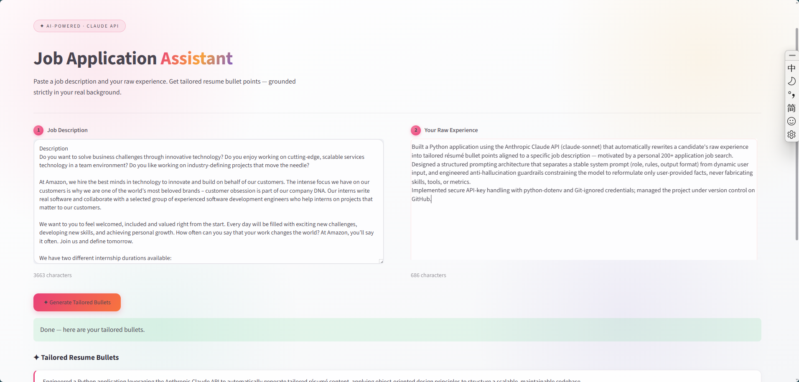
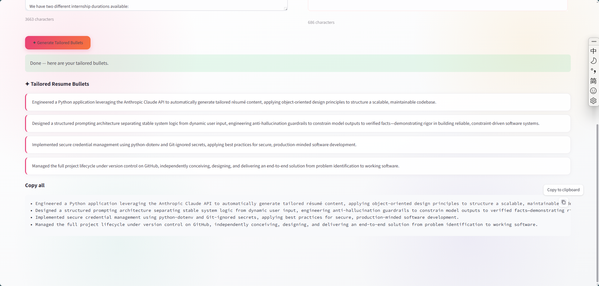

# Job Application Assistant

An AI-powered tool that tailors resume bullet points to a specific job description, built with Python and the Anthropic Claude API. Motivated by a personal 200+ application job search — the goal is to reframe real experience to match what each role is actually asking for, without ever fabricating anything.

## What it does

Paste in a target job description and your raw experience; the app returns 3–4 tailored, action-verb-driven resume bullet points that emphasize the parts of your real background most relevant to the role.

## Key design decisions

- **In-context prompting** over fine-tuning or RAG: all information needed lives in a single request, so a well-structured prompt is the most appropriate and cost-effective approach.

- **Structured prompt architecture**: a stable system prompt (role, rules, output format) is separated from dynamic user input.

- **Anti-hallucination guardrails**: the model is explicitly constrained to reformulate only user-provided facts and never invent skills, tools, or metrics.

- **Robust response parsing**: content is parsed by filtering for text blocks by type, rather than relying on position.

## Tech stack

Python · Anthropic Claude API (claude-sonnet) · Streamlit · python-dotenv

## Running locally

1. Clone the repo and create an environment (Python 3.12).

2. `pip install anthropic python-dotenv streamlit`

3. Create a `.env` file with your key: `ANTHROPIC\_API\_KEY=sk-ant-...`

4. Run the web app: `streamlit run app.py`

## Project structure

- `app.py` — Streamlit web interface

- `tailor.py` — core tailoring logic (CLI version)

- `test\_api.py` — API connectivity check

